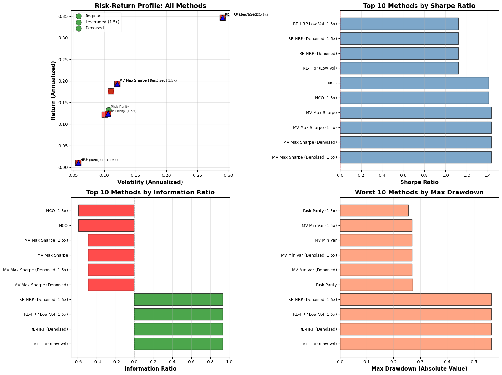

# Portfolio Construction Research using Machine Learning

Advanced portfolio optimization methods including Hierarchical Risk Parity (HRP), Risk Parity, Nested Clustered Optimization (NCO), and Mean-Variance Optimization based on the research of multiple authors.

## Research Citations

This repository implements portfolio optimization algorithms based on the following foundational research papers:

1. **Markowitz, H. (1952)**. Portfolio Selection. *The Journal of Finance*, 7(1), 77-91.
   - Introduces Modern Portfolio Theory and Mean-Variance Optimization
   - Foundation for all portfolio optimization methods

2. **De Prado, M. L. (2016)**. Building Diversified Portfolios that Outperform Out of Sample. *The Journal of Portfolio Management*, 42(4), 59-69.
   - Introduces Hierarchical Risk Parity (HRP)
   - Introduces Nested Clustered Optimization (NCO)
   - Addresses the "Markowitz curse" and estimation errors
   - **For in-depth HRP understanding**: See De Prado (2018) "Advances in Financial Machine Learning" - highly recommended reading

3. **Maillard, S., Roncalli, T., & Teiletche, J. (2010)**. The Properties of Equally Weighted Risk Contribution Portfolios. *The Journal of Portfolio Management*, 36(4), 60-70.
   - Formalizes the Risk Parity (Equal Risk Contribution) approach
   - Provides theoretical foundation and optimization framework

4. **Roncalli, T. (2013)**. Introduction to Risk Parity and Budgeting. *CRC Press*.
   - Comprehensive treatment of risk-based portfolio construction
   - Extends Risk Parity concepts to risk budgeting

**Important Note**: This repository implements these methods for educational and research purposes. The original research and algorithms are attributed to the authors cited above. This work focuses on providing clear, production-ready implementations and comprehensive examples of how to use these methods.

## Overview

This repository provides implementations and demonstrations of advanced portfolio optimization techniques that address the limitations of traditional mean-variance optimization. The methods implemented here are based on the groundbreaking work of multiple researchers who have advanced the field beyond Markowitz's original framework.

### Portfolio Performance Results



*Comprehensive risk-return analysis comparing multiple portfolio optimization methods across different use cases, including regular, leveraged, and denoised variants.*

## Key Features

### Portfolio Optimization Methods

1. **Hierarchical Risk Parity (HRP)**
   - Uses hierarchical clustering to construct diversified portfolios
   - Avoids covariance matrix inversion, making it more stable
   - Robust to estimation errors and high-dimensional problems
   - **Recommended Reading**: De Prado (2018) "Advances in Financial Machine Learning" provides in-depth understanding of HRP implementation and theory

2. **Risk Parity (Equal Risk Contribution)**
   - Allocates weights such that each asset contributes equally to portfolio risk
   - Does not require expected return estimates
   - More stable than mean-variance optimization

3. **Nested Clustered Optimization (NCO)**
   - Reduces dimensionality by clustering assets first
   - Optimizes within clusters, then between clusters
   - Handles large portfolios more effectively

4. **Classical Efficient Frontier**
   - Mean-variance optimization for comparison
   - Demonstrates limitations of traditional approaches

## Installation

### Prerequisites

- Python >= 3.12
- pip or uv package manager

### Install Dependencies

Using pip:
```bash
pip install -r requirements.txt
```

Or using uv (recommended):
```bash
uv sync
```

### Key Dependencies

- `numpy` - Numerical computations
- `pandas` - Data manipulation
- `scipy` - Scientific computing and optimization
- `matplotlib` - Visualization
- `yfinance` - Financial data retrieval
- `scikit-learn` - Machine learning utilities

## Quick Start

### Basic Usage

```python
from portfolios.portfolio_src import HierarchicalRiskParity, RiskParity, NestedClusteredOptimization
import pandas as pd
import yfinance as yf

# Download historical data
tickers = ["AAPL", "MSFT", "GOOGL", "TSLA", "NVDA"]
df = yf.download(tickers, start='2020-01-01')
returns = df['Close'].pct_change().dropna()

# Hierarchical Risk Parity
hrp = HierarchicalRiskParity()
hrp.fit(returns)
weights = hrp.predict()
return_annual, vol_annual, sharpe = hrp.portfolio_performance(risk_free_rate=0.02)

print(f"HRP Portfolio - Return: {return_annual:.2%}, Volatility: {vol_annual:.2%}, Sharpe: {sharpe:.3f}")
```

### Comprehensive Example

See `Portfolio_Analysis.ipynb` for a complete demonstration including:
- Efficient frontier analysis for each method
- Out-of-sample testing framework
- Risk-adjusted performance comparisons
- Visualizations and metrics

## Financial Glossary

For definitions of all financial terms used in the analysis (Sharpe Ratio, Information Ratio, Volatility, Max Drawdown, etc.), see:

**[FINANCIAL_GLOSSARY.md](FINANCIAL_GLOSSARY.md)**

This glossary provides comprehensive definitions of:
- Portfolio performance metrics (Return, Volatility, Sharpe Ratio, Information Ratio, Max Drawdown)
- Portfolio optimization methods (HRP, Risk Parity, NCO, RE-HRP, Mean-Variance)
- Portfolio modifications (Leveraged portfolios, Denoised portfolios)
- Additional financial terms and concepts

## Project Structure

```
.
├── portfolios/
│   ├── portfolio_src/          # Core optimization algorithms
│   │   ├── base_optimizer.py   # Base class for all optimizers
│   │   ├── hierarchical_risk_parity.py
│   │   ├── risk_parity.py
│   │   ├── nested_clustered_optimization.py
│   │   └── portfolio_tests/    # Test suite and documentation
│   ├── portfolio_docs/         # Documentation and results
│   │   └── results.png         # Portfolio performance visualization
│   └── utilities/              # Portfolio utility functions
│       └── portfolio_utilties.py
├── Portfolio_Analysis.ipynb     # Comprehensive analysis notebook
├── portfolio_real_world_usecases.ipynb  # Real-world use case demonstrations
├── FINANCIAL_GLOSSARY.md        # Financial terms glossary
├── tests/                       # Integration tests
└── README.md                    # This file
```

## API Reference

All portfolio optimizers follow a consistent interface:

```python
# Initialize
optimizer = OptimizerClass(**kwargs)

# Fit on historical returns
optimizer.fit(returns_df)  # returns_df: pd.DataFrame with assets as columns

# Get portfolio weights
weights = optimizer.predict()  # Returns: np.ndarray

# Get performance metrics
return_annual, vol_annual, sharpe = optimizer.portfolio_performance(risk_free_rate=0.02)
```

### HierarchicalRiskParity

```python
hrp = HierarchicalRiskParity(linkage_method='ward', distance_metric='euclidean')
hrp.fit(returns_df)
weights = hrp.predict()
```

### RiskParity

```python
rp = RiskParity(method='SLSQP', max_iter=1000)
rp.fit(returns_df)
weights = rp.predict()
risk_contributions = rp.get_risk_contribution_percentages()
```

### NestedClusteredOptimization

```python
nco = NestedClusteredOptimization(
    n_clusters=4,
    within_cluster_method='risk_parity',  # or 'mean_variance'
    linkage_method='ward'
)
nco.fit(returns_df)
weights = nco.predict()
clusters = nco.get_cluster_assignments()
```

## Mathematical Foundations

For detailed mathematical explanations of each method, see:
- `portfolios/portfolio_src/portfolio_tests/PORTFOLIO_MATH_FOUNDATIONS.md`

This document provides:
- Complete mathematical formulations
- Algorithm walkthroughs
- Proofs and derivations
- Step-by-step examples

## Out-of-Sample Testing

The `Portfolio_Analysis.ipynb` notebook includes a comprehensive out-of-sample testing framework that:
- Splits data into training (70%) and testing (30%) sets
- Evaluates portfolio stability across time periods
- Focuses on risk-adjusted performance metrics
- Compares train vs test performance

## References and Attributions

### Primary Research Papers

1. **Markowitz, H. (1952)**. Portfolio Selection. *The Journal of Finance*, 7(1), 77-91.
   - Introduces Modern Portfolio Theory
   - Foundation for Mean-Variance Optimization
   - Establishes the efficient frontier concept

2. **De Prado, M. L. (2016)**. Building Diversified Portfolios that Outperform Out of Sample. *The Journal of Portfolio Management*, 42(4), 59-69.
   - Introduces Hierarchical Risk Parity (HRP)
   - Introduces Nested Clustered Optimization (NCO)
   - Methods to address the "Markowitz curse" and estimation errors
   - DOI: https://doi.org/10.3905/jpm.2016.42.4.059

3. **Maillard, S., Roncalli, T., & Teiletche, J. (2010)**. The Properties of Equally Weighted Risk Contribution Portfolios. *The Journal of Portfolio Management*, 36(4), 60-70.
   - Formalizes the Risk Parity (Equal Risk Contribution) approach
   - Provides theoretical foundation and optimization framework
   - Establishes risk contribution formulas and optimization methods

4. **Roncalli, T. (2013)**. Introduction to Risk Parity and Budgeting. *CRC Press*.
   - Comprehensive treatment of risk-based portfolio construction
   - Extends Risk Parity concepts to risk budgeting
   - Provides practical implementation guidance

### Recommended Reading

**De Prado, M. L. (2018)**. Advances in Financial Machine Learning. *John Wiley & Sons*.
- **Essential resource for in-depth understanding of HRP**: Provides comprehensive coverage of Hierarchical Risk Parity with detailed explanations, implementations, and extensions
- Comprehensive book covering machine learning applications in finance
- Includes practical implementations and advanced techniques for HRP and NCO
- Highly recommended for practitioners seeking deeper understanding of the algorithms

### Implementation Notes

This repository implements these methods for educational and research purposes. The algorithms and mathematical foundations are based on the work cited above. This implementation focuses on:
- Clear, production-ready code
- Comprehensive documentation
- Practical examples and demonstrations
- Out-of-sample validation

## Contributing

Contributions are welcome! Please feel free to submit a Pull Request. Areas for contribution:
- Additional optimization methods
- Performance improvements
- Documentation enhancements
- Test coverage expansion

### Pre-Commit Requirements

**⚠️ IMPORTANT: Before committing, you MUST run:**

```bash
uv run ruff check
```

All code must pass ruff linting checks. See [CONTRIBUTING.md](CONTRIBUTING.md) for detailed guidelines.

## License

This project is licensed under the MIT License - see the [LICENSE](LICENSE) file for details.

## Disclaimer

This software is provided for educational and research purposes only. It is not intended as financial advice. Past performance does not guarantee future results. Always consult with a qualified financial advisor before making investment decisions.

## Acknowledgments

- **Harry Markowitz** for establishing Modern Portfolio Theory and Mean-Variance Optimization
- **Marcos Lopez de Prado** for the groundbreaking research on Hierarchical Risk Parity and Nested Clustered Optimization
- **Sébastien Maillard, Thierry Roncalli, and Jérôme Teiletche** for formalizing the Risk Parity approach
- **Thierry Roncalli** for comprehensive work on risk-based portfolio construction
- The open-source community for various implementations that informed this work
- Contributors and users who provide feedback and improvements

---

For questions, issues, or contributions, please open an issue on the GitHub repository.

